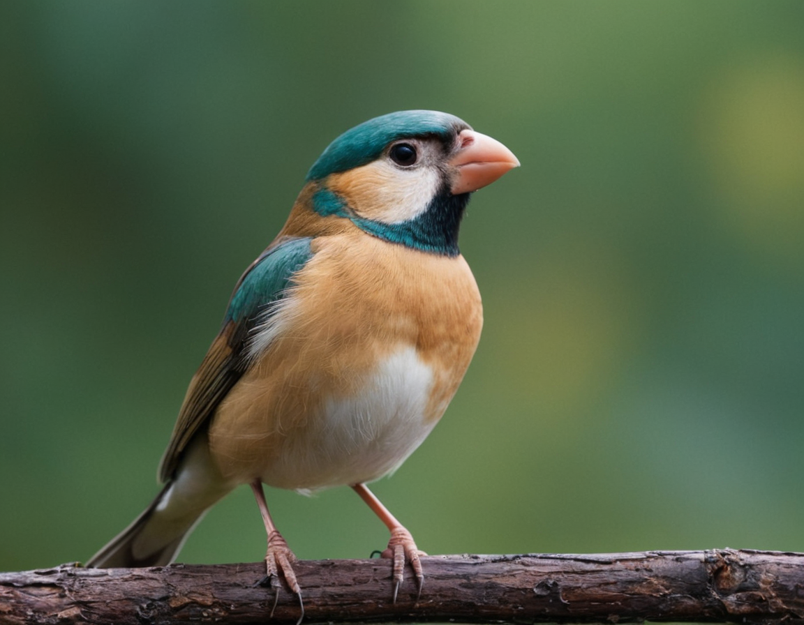

# 创意生图场景应用指南
随着AI大模型技术的快速发展，特别在大模型开源的促进下，创意生图越来越频繁地进入日常生活，影响了众多的行业。同时随着AI能力的持续增强，也在不断促进很多新职业的产生和旧职业的转型。为此，我们通过互联网搜集整理，并经过亲身实践，梳理了各种创意生图的使用场景。这一方面让新手可以按图索骥，对使用SimpleSDXL/Fooocus有所帮助。同时，也希望基于场景的分析找到SimpleSDXL需要增补及增强的功能需求，促进SimpleSDXL的持续优化和完善。

参与编撰人：metercai，liguotao1，grady-lee，xxxx

### 1. 媒体创作

#### 1.1 社交平台头像设计

##### 1.1.1 场景说明

在社交平台头像生成中，SimpleSDXL可以帮助用户创建个性化、独特的头像，展示自己的风格和个性。生成各种形式的头像，包括卡通形象、抽象艺术、动物形象等，以满足用户的不同需求和喜好。这种应用可以帮助用户在社交平台上更好地展示自己，增强用户的个人形象和认同感。

##### 1.1.2 效果展示

- 动漫头像生成

-  照片转动漫头像 

##### 1.1.3实现原理

-  使用文生图
	使用文生图，输入Prompt，实现头像生成，可以根据自己的社交主题或者风格实现生成，可以采用SimpleSDXL的不同的模型实现，在这里我才用动漫风格，结合Blindbox生成盲盒效果。 
-  使用图片提示
	使用图生图实现将照片转换为动漫风格，需要使用以下步骤: 
   - 使用图像提示，输入照片，并设置边缘检测
   - 设置动漫模型(animaPencilXL)，精炼模型采用(revAnimated)，Lora采用blindbox_V1Mix
   - 输入样式动作的Prompt提示词，多次输入并进行微调

##### 1.1.4 视频案例

- 主题: 风格转换-真人转动漫
- 视频链接: [点击访问](https://www.bilibili.com/video/BV1Lx4y1e7fo/)
- 博主: xhox

#### 1.2 社交平台背景设计

##### 1.2.1 场景说明

在社交平台背景设计中，SimpleSDXL可以帮助设计师创造独特、吸引人的背景图像，提升用户体验和社交平台的品牌形象。通过生成丰富多样的背景图像，包括抽象艺术、自然风光、城市景观等，以满足不同用户的喜好和需求。可以帮助社交平台吸引更多用户，提高用户参与度和留存率。

SimpleSDXL可以根据用户的个性化喜好和社交平台的定位，生成与之相匹配的背景图像，使得用户在使用社交平台时感到更加舒适和愉悦。还可以根据不同的时间、节日和主题，动态生成背景图像，增加社交平台的活力和趣味性。

##### 1.2.2 效果展示

-  治愈风格 

-  恐怖风格

-  儿童节主题背景

-  春节主题

##### 1.2.3实现原理

 	1. 根据社交平台的定位或生成的主题，选择合适的大模型(写实、动漫等)
 	1. 编写文生图Prompt，描述图片的内容
 	1. 根据主题选择合适的风格生成

##### 1.2.4 视频案例

#### 1.3 文章正文配图

##### 1.3.1 场景说明

在文章正文配图中，SimpleSDXL可以帮助作者和编辑选择和生成适合文章内容的插图，提升文章的视觉吸引力和表现力。SimpleSDXL可以根据文章的主题、情感和风格，生成与之相匹配的插图，包括插画、图表、图形等，以增强文章的可读性和表达效果。这种应用可以帮助作者更好地传达文章的意义和信息，同时也能提高读者的阅读体验和理解能力。

##### 1.3.2 效果展示

##### 1.3.3实现原理

1. 根据上下文提取文生图提示词，选择主模型和风格，实现图片生成
2. 可以配置通配符，实现批量图片生成

##### 1.3.4 视频案例

#### 1.4 宣传推广内容生成

##### 1.4.1 场景说明

在宣传推广内容生成中，SimpleSDXL可以生成各种形式的宣传推广内容，包括海报、广告、插图、动画等，以满足不同推广需求和目标受众。这种应用可以帮助企业和品牌更好地传达产品和服务的特点和价值，吸引潜在客户的关注和兴趣，提高推广活动的转化率和销售额。

##### 1.4.2 效果展示

- 公益宣传

* 广告宣传

  

##### 1.4.3实现原理

采用文生图，输入需要促销的内容和宣传主题文字内容，风格，光线和风格等必要条件。

##### 1.4.4 视频案例

### 2. 广告与营销

#### 2.1 应用程序LOGO设计

##### 2.1.1 场景说明

在应用程序LOGO设计中，SimpleSDXL可以帮助设计师和企业创造独特、专业的标志，提升应用程序的品牌形象和辨识度。可以生成各种形式的LOGO设计，包括图形、字体、图标等，以满足不同应用程序的定位和风格。

##### 2.1.2 效果展示

-  驴友app

##### 2.1.3实现原理

文生图，背景设计，文字，色彩搭配和表达的主题。

##### 2.1.4 视频案例

#### 2.2 网站图标与徽章设计

##### 2.2.1 场景说明

在网站图标与徽章设计中，通过使用SimpleSDXL，可以生成各种形式的图标和徽章设计，包括简约的线图、丰富的色彩、精细的细节等，以满足不同网站的定位和风格。

##### 2.2.2 效果展示

- 帆船运动网站

##### 2.2.3实现原理

通过输入描述网站或组织特色的文本提示，调整图像的色彩、形状、布局等，以确保它们与网站或组织的品牌形象和视觉风格相契合。

##### 2.2.4 视频案例

#### 2.3 社交媒体图标设计

##### 2.3.1 场景说明

在社交媒体图标设计中，SimpleSDXL可以帮助设计师和企业创造独特、简洁的图标，提升社交媒体平台的品牌形象和用户体验。生成各种形式的社交媒体图标设计，包括简约的线图、鲜明的色彩、易于识别的图形等，以满足不同社交媒体平台的定位和风格。

##### 2.3.2 效果展示

- 即时通讯app

##### 2.3.3实现原理

通过文生图功能，调整图标的颜色、形状、布局等细节，以确保其能够更好地体现品牌风格和传达目标信息。同时，设计师还可以结合其他设计元素，如字体、图标样式等，来增强图标的辨识度和吸引力。

##### 2.3.4 视频案例

#### 2.4 海报设计

##### 2.4.1 场景说明

在社交媒体海报设计中，SimpleSDXL可以帮助设计师创作出引人注目、富有创意的海报，吸引用户的注意力并传达信息。设计师可以使用SimpleSDXL生成各种风格的海报，包括现代简约、复古怀旧、艺术抽象等，以适应不同的社交媒体平台和目标受众。

同时可以不断调整，生成独特的图案、色彩和字体，快速生成多个设计方案，以便选择最佳的设计方案，使海报更具视觉冲击力和吸引力，并节省设计时间和成本。

##### 2.4.2 效果展示

##### 2.4.3实现原理

文生图输入文本提示可以描述海报的主题、色彩、元素等，帮助模型生成与需求匹配的图像。

##### 2.4.4 视频案例

### 3. 家装与建筑

#### 3.1 建筑设计

##### 3.1.1 场景说明

在建筑设计中，SimpleSDXL可以帮助建筑师和设计师创作出独特、创新的建筑外观和室内设计。使用SimpleSDXL，设计师可以生成各种风格的建筑外观，包括现代简约、古典复古、有机自然等，以满足不同项目的需求和客户的喜好。

##### 3.1.2 效果展示

##### 3.1.3实现原理

模型会根据输入的文本提示，生成一系列与建筑设计相关的图像。这些图像可能包括建筑的整体形态、立面设计、内部空间布局等。设计师可以从生成的图像中选择出符合设计需求的初步方案，并进一步进行优化和调整。

##### 3.1.4 视频案例

#### 3.2 室内设计

##### 3.2.1 场景说明

在室内设计领域，SimpleSDXL可以帮助设计师和客户更好地展示和理解设计概念。通过使用SimpleSDXL技术，可以创建逼真的室内场景，包括家具、墙壁、地板、灯光等元素，以及不同的风格和色彩搭配。这种应用可以帮助设计师更快速地生成多种设计方案，并让客户更直观地感受到最终效果，从而更好地参与和决策设计过程。

##### 3.2.2 效果展示

##### 3.2.3实现原理

通过文本提示输入到模型中。这些文本提示可以描述空间的布局、家具的样式、色彩的运用等，以便模型能够根据这些提示生成相应的设计图像。

##### 3.2.4 视频案例

#### 3.3 家装设计

##### 3.3.1 场景说明

在家装设计场景中，SimpleSDXL可以为设计师和业主提供更加直观、生动的家居空间展示。设计师可以将自己的创意和想法以更加真实、立体的方式呈现出来，让业主更好地理解和感受家居的布局、色彩搭配、家具摆放等细节。同时还可以根据业主的需求和偏好进行个性化定制，为业主提供更加满意的家装设计方案。

##### 3.3.2 效果展示

##### 3.3.3实现原理

设计师需要明确家装设计的目标和需求，包括房间的功能布局、风格定位、色彩搭配以及材料选择等。这些需求将通过文本提示的方式输入，生成与家装设计相关的图像。这些图像可能包括房间的布局草图、家具摆放、装饰元素的呈现以及整体氛围的渲染等。

##### 3.3.4 视频案例

### 4. 图像风格转换

#### 4.1 黑白照片上色

##### 4.1.1 场景说明

在黑白照片上色场景中，通过SimpleSDXL可以将黑白照片上色，让照片中的人物、场景、物体等更加真实、立体，增强照片的观赏性和艺术性。通过还原照片中的色彩，我们可以更深入地理解当时的社会背景、人物情感和故事情节，引发观众的情感共鸣。

##### 4.1.2 效果展示

##### 4.1.3实现原理

使用图像提示中的边缘检测，如果是3D模型需要加入3D检测，通过文本描述填充色彩和风格，也可以使用自动化Lora实现。

后续会加入recolor实现自动上色。

##### 4.1.4 视频案例

- 主题: 线稿上色
- 视频链接: [点击访问](https://www.bilibili.com/video/BV1dC4y1Y77A)
- 博主: 吴杨峰

#### 4.2 绘画风格转换
* 图生图技巧

##### 4.2.1 场景说明

在绘画风格转换场景中，SimpleSDXL可以为设计师提供更加多样化、创新的绘画风格展示。通过SimpleSDXL可以将自己的作品转换成不同的绘画风格，如印象派、立体派、抽象派等，以丰富作品的表现形式和艺术内涵。还可以根据需求和偏好进行个性化风格转换，为艺术创作提供更加高效、精准的方案。

##### 4.2.2 效果展示

| 动漫                                                         | 写实                                              |
| ------------------------------------------------------------ | ------------------------------------------------- |
|  |  |

##### 4.2.3实现原理

1. 生成原照片或者获取现实中拍摄的图片
2. 使用图像提示，配置边缘检测，深度检测和换脸
3. 选择不同的模型和风格
4. 加入文本提示词实现生成

##### 4.2.4 视频案例

- 主题: Fooocus图生图技巧
- 视频链接: [点击访问](https://www.bilibili.com/video/BV187421N7aR/)
- 博主: 是说新语111

#### 4.3 滤镜效果应用

##### 4.3.1 场景说明

在滤镜效果应用场景中，通过SimpleSDXL，设计师可以将自己的图像应用不同的滤镜效果，如黑白、复古、艺术等，以增强图像的艺术感和表现力。同时可以根据设计师的需求和偏好进行个性化滤镜效果应用，为图像处理提供更加高效、精准的方案。

##### 4.3.2 效果展示

| 原照片                 | 白柔滤镜               |
| ---------------------- | ---------------------- |
|  |  |

##### 4.3.3实现原理

1. 输入图片，采用图片提示，包含脸部交换、边缘检测、结构深度、内容元素
2. 更换模型或者采用不同的风格(白柔、黑柔等)实现图片输出

##### 4.3.4 视频案例

#### 4.4 风格迁移

##### 4.4.1 场景说明

通过SimpleSDXL，可以将一张图片的风格迁移到另一张图片上，实现风格的融合与转换。将自己的图像应用不同的艺术风格，如印象派、立体派、抽象派等。例如，可以将一幅古典油画的风格应用到现代摄影作品上，或将一种流行的艺术风格应用于产品设计图。

##### 4.4.2 效果展示
| 原照片               | 风格迁移               |
| -------------------- | ---------------------- |
|  |  |

##### 4.4.3实现原理

输入原图片，采用内容元素并添加相应的文本提示实现图片生成。

##### 4.4.4 视频案例

- 主题: Fooocus图生图技巧
- 视频链接: [点击访问]([https://www.bilibili.com/video/BV16B4y1Z7LP/](https://www.bilibili.com/video/BV16B4y1Z7LP/))
- 博主: AK智汇

### 5. 图像修复与增强

#### 5.1 老照片修复

##### 5.1.1 场景说明

照片往往承载着珍贵的历史记忆和文化价值，但由于时间的流逝和保存条件的影响，它们可能会出现褪色、破损等问题，导致细节和色彩丢失。通过SimpleSDXL可以有效地修复这些老照片，恢复其原有的细节，让历史记忆得以重现，让文化价值得以传承。

##### 5.1.2 效果展示

##### 5.1.3实现原理

1. 采用图生图方式，在图片提示中，选择换脸交换、边缘检测
2. 在放大与变化中，选择细微变化

##### 5.1.4 视频案例

- 主题: 老照片修复实战教程
- 视频链接: [点击访问]([[https://www.bilibili.com/video/BV1ue411m7nG/](https://www.bilibili.com/video/BV1ue411m7nG/))
- 博主: 村边小河666

#### 5.2 模糊图像清晰化

##### 5.2.1 场景说明

使用SimpleSDXL，可以实现对模糊图像的清晰化处理，恢复图像的细节和清晰度。经过处理后的图像，可以更加清晰、细腻，更加逼真地呈现图像的真实场景。

##### 5.2.2 效果展示

##### 5.2.3实现原理

​	加入SUPIR等清晰化的模型。

##### 5.2.4 视频案例

- 主题: 老照片修复+图片高清化+一键抠图超详细讲解
- 视频链接: [点击访问](https://www.bilibili.com/video/BV1As4y117N7)
- 博主: AI小王子Jay

#### 5.3 图像超分辨率增强

##### 5.3.1 场景说明

超分辨率增强技术能够显著提升图像的分辨率和清晰度，使得原本模糊或低分辨率的图像变得更为清晰和细腻。这对于许多领域，如医学影像、安防监控、卫星遥感等，都具有重要的应用价值。我们可以对这些图像进行高效、准确的超分辨率处理，从而提取更多的细节信息。

##### 5.3.2 效果展示

##### 5.3.3实现原理

采用图片提示并结合放大(2倍加细节)。

##### 5.3.4 视频案例

- 主题: 老照片修复+图片高清化+一键抠图超详细讲解
- 视频链接: [点击访问](https://www.bilibili.com/video/BV1As4y117N7)
- 博主: AI小王子Jay

#### 5.4 去除图像瑕疵或多余元素

##### 5.4.1 场景说明

在图像处理和计算机视觉领域，图像瑕疵和多余元素是常见的问题，它们可能是由于图像采集设备的限制、图像传输过程中的失真或者图像处理算法的不足等原因引起的。这些瑕疵和多余元素会影响图像的质量和可用性，甚至会干扰图像的分析和识别。因此，去除图像瑕疵和多余元素是一个重要的研究方向和应用场景。使用SimpleSDXL，可以实现对图像瑕疵和多余元素的去除处理，提高图像的质量和可用性。

##### 5.4.2 效果展示
| 原照片                           | 去除元素                |
| -------------------------------- | ----------------------- |
|  |  |

##### 5.4.3实现原理

1. 提示词反推，删除额外的提示词，配合图片提示和文本提示实现
2. 采用内外重绘，使用画笔涂抹需要去除的内容，方式使用默认即可，结合文本提示实现内容消除

##### 5.4.4 视频案例

- 主题: 如何使用SD消除图片中的文字或物体
- 视频链接: [点击访问](https://www.bilibili.com/video/BV18m4y1x7VD)
- 博主: 万物熔炉

### 6. 线稿提取与着色

#### 6.1 手绘线稿提取

##### 6.1.1 场景说明

传统的手绘过程耗时耗力，而且难以进行修改和调整。通过使用SimpleSDXL模型进行手绘线稿提取，快速将手绘草图转化为数字线稿，进而在数字环境中进行后续的编辑和创作。

##### 6.1.2 效果展示

| 手绘稿                                                       | 电子稿                                                       |
| ------------------------------------------------------------ | ------------------------------------------------------------ |
|  |  |

##### 6.1.3实现原理

1. 使用图像输入，利用图片提示中的边缘检测，配合线条艺术风格，输入文字提示，实现线稿提取
2. 使用图像输入，利用图片提示中的边缘检测，配合Anime Lineart模型实现线稿提取

##### 6.1.4 视频案例

- 主题: 线稿提取
- 视频链接: [点击访问](https://www.bilibili.com/video/BV1T94y16753)
- 博主: 虫虫飞乐园

#### 6.2 照片转线稿

##### 6.1.1 场景说明

照片转线稿是一种常见的图像处理技术，它可以将照片转换成线条艺术风格的图像，使得图像更加简洁、清晰，更加适合用于插画、漫画、设计等领域。传统的照片转线稿方法需要手工绘制，耗时耗力，SimpleSDXL可以实现自动化的照片转线稿处理，大大提高了效率和质量。

使用SimpleSDXL，可以实现对照片的自动转换，将照片转换成线条艺术风格的图像。经过处理后的图像，可以更加简洁、清晰，更加逼真地呈现图像的线条和结构信息。同时还可以根据不同的线条风格和参数设置，实现不同的线条艺术效果，满足不同的应用需求。

##### 6.1.2 效果展示

| 照片                                                         | 线稿                                                         |
| ------------------------------------------------------------ | ------------------------------------------------------------ |
|  |  |

##### 6.1.3实现原理

1. 使用图像输入，利用图片提示中的边缘检测，配合线条艺术风格，输入文字提示，实现线稿提取
2. 使用图像输入，利用图片提示中的边缘检测，配合Anime Lineart模型实现线稿提取

##### 6.1.4 视频案例

- 主题: 照片转线稿
- 视频链接: [点击访问](https://www.bilibili.com/video/BV1dg4y1K7L9)
- 博主: 斯九阳

#### 6.3 插画线稿生成

##### 6.1.1 场景说明

传统的插画线稿生成方法需要手工绘制，耗时耗力，使用SimpleSDXL可以实现自动化的插画线稿生成，大大提高了效率和质量，使得图像更加生动、有趣。

##### 6.1.2 效果展示

##### 6.1.3实现原理

​	采用文本提示，采用Anime Lineart模型配合线条格式实现图像生成

##### 6.1.4 视频案例

- 主题: 如何用Controlnet来创建线稿作品
- 视频链接: [点击访问](https://www.bilibili.com/video/BV18T411a77j)
- 博主: 人工治障

#### 6.4 建筑设计线稿生成

##### 6.1.1 场景说明

采用SimpleSDXL可以更加简洁、清晰，更加逼真地呈现建筑设计的线条和结构信息。根据不同的线条风格和参数设置，实现不同的线条艺术效果，满足不同的应用需求。

##### 6.1.2 效果展示

##### 6.1.3实现原理

​	采用文本提示，采用Anime Lineart模型配合线条格式实现图像生成

##### 6.1.4 视频案例

- 主题: 如何用Controlnet来创建线稿作品
- 视频链接: [点击访问](https://www.bilibili.com/video/BV18T411a77j)
- 博主: 人工治障

#### 6.5 线稿着色
##### 6.1.1 场景说明

通过调整模型参数和着色风格，艺术家可以轻松地实现不同风格的着色效果，从而探索出更多新颖、独特的创作思路。这有助于打破传统着色的局限性，推动艺术创作的多样性和创新性。

##### 6.1.2 效果展示

* 案例一

  | 线稿                                                         | 着色                                                         |
  | ------------------------------------------------------------ | ------------------------------------------------------------ |
  |  |  |

* 案例二

  | 线稿                                                         | 着色                                                         |
  | ------------------------------------------------------------ | ------------------------------------------------------------ |
  |  |  |

##### 6.1.3实现原理

1. 在图片输入中，通过图像提示的边缘检测，配合文本提示实现配色
2. 后续将添加recolor实现自动着色

##### 6.1.4 视频案例

- 主题: fooocus线稿上色
- 视频链接: [点击访问](https://www.bilibili.com/video/BV1dC411s7Z1)
- 博主: 是说新语111

### 7. 图像合成与拼接

#### 7.1 多重图像融合

##### 7.1.1 场景说明

将原本分散的信息和元素结合在一起，形成具有深意的整体画面。这种融合不仅丰富了作品的视觉效果，还有助于表达更为复杂、深刻的思想和情感。

##### 7.1.2 效果展示

- 融合前

  |  |  |
  | ------------------------------------------------------------ | ------------------------------------------------------------ |

-  融合后

##### 7.1.3实现原理

​	图片输入中，通过输入多个图片实现自动融合，可以配合文本提示，实现更加定制化的输出

##### 7.1.4 视频案例

- 主题: Fooocus进阶技巧 · 风格转绘，扩图，换脸
- 视频链接: [点击访问](https://www.bilibili.com/video/BV1Br421x7uL/)
- 博主: 魏岚Levi

#### 7.2 图像拼接(全景图生成)

##### 7.2.1 场景说明

通过将多张局部图像拼接在一起，我们可以获得一个连续、无缝的全景图像，从而能够更全面地了解场景的全貌。这种全景图在旅游、地产、虚拟现实等领域具有广泛应用，能够为用户提供沉浸式的视觉体验，帮助他们更好地了解环境和空间布局

##### 7.2.2 效果展示

##### 7.2.3实现原理

1. 获取多个角度的场景照片，通过图像输入，图片提示和文本提示配置角度和坐标实现融合
2. 也可以通过图像输入，采用内外重绘中的左右扩展，实现全景图生成

##### 7.2.4 视频案例

- 主题:  360度全景图生成方法
- 视频链接: [点击访问](https://www.bilibili.com/video/BV1Fz4y137Vk)
- 博主: 坏心眼猫特效

#### 7.3 元素替换与合成
##### 7.3.1 场景说明

轻松地将图像中的某个元素替换为另一个元素，或者将多个元素合成在一起，创造出全新的视觉效果。能够更自由地表达创意，实现更加个性化和独特的作品。

##### 7.3.2 效果展示

* 案例一

  | 原照片                                                       | 合成                                                         |
  | ------------------------------------------------------------ | ------------------------------------------------------------ |
  |  |  |

* 案例二

  | 原照片                                                       | 合成                                                         |
  | ------------------------------------------------------------ | ------------------------------------------------------------ |
  |  |  |

##### 7.3.3实现原理

1. 在图像输入中，找到内外重绘，输入需要合成或者替换的图片
2. 使用绘笔选中需要重绘的地方，在方法中选择Modify Content (add objects, change background, etc.)
3. 在文本提示中，输入需要重绘的内容，实现图片输出

##### 7.3.4 视频案例

- 主题:  fooocus亿点点技巧，换装技巧，换衣服，加帽子
- 视频链接: [点击访问](https://www.bilibili.com/video/BV16H4y177gG/)
- 博主: 是说新语111

#### 7.4 图像蒙版

##### 7.4.1 场景说明

使用SimpleSDXL，可以实现对图像的自动蒙版制作，根据图像的内容和特征，自动生成适当的蒙版效果。可以更加精确地控制图像的显示和隐藏，提高图像的质量和效果。

##### 7.4.2 效果展示

| 原照片                                                       | 蒙版                                                         |
| ------------------------------------------------------------ | ------------------------------------------------------------ |
|  |  |

##### 7.4.3实现原理

​	在图像输入的内外重绘中，输入图片，使用重汇蒙版实现蒙版生成

##### 7.4.4 视频案例

- 主题: 局部重绘与蒙版重绘
- 视频链接: [点击访问](https://www.bilibili.com/video/BV1mj411j7fv)
- 博主: 原创ai绘画设计师

### 8. 动画与游戏

#### 8.1 动画设计

##### 8.1.1 场景说明

使用SimpleSDXL，可以实现对静态图像或者场景的自动动画设计，根据图像或者场景的内容和特征，自动生成适当的动画效果。

##### 8.1.2 效果展示

##### 8.1.3实现原理

1. 通过文生图生成满意的图像，固定种子
2. 在图像提示中，使用图像提示的脸部交换，配合文本提示实现角色一致性和动作、服装、背景等的生成
3. 使用图片融合，后续加入Animediff等实现动画生成

##### 8.1.4 视频案例

- 主题: AnimateDiff动画插件全方位教学
- 视频链接: [点击访问](https://www.bilibili.com/video/BV1zS421A7PG)
- 博主: Nenly

#### 8.2 形象设计

##### 8.2.1 场景说明

在形象设计领域，SimpleSDXL可以帮助设计师和动画制作团队更快速、高效地创造出独特、生动的角色形象。可以生成各种不同风格和类型的动画角色，包括人物、动物、怪物等，从而满足不同类型动画作品的需求。

##### 8.2.2 效果展示

##### 8.2.3实现原理

1. 通过文本提示，使用动漫大模型，配合BlindBox等3D LoRA实现三视图生成。

##### 8.2.4 视频案例

- 主题: 运用AI实现原创IP形象2D转3D效果
- 视频链接: [点击访问](https://www.bilibili.com/video/BV1hs4y117qA)
- 博主: 插画师小光sir

#### 8.3 原画设计

##### 8.3.1 场景说明

在原画设计领域，SimpleSDXL可以帮助插画师和动画师更快速、高效地创作出独特、生动的原画作品。可以生成各种不同风格和类型的原画作品，包括插画、概念艺术、角色设计等，从而满足不同类型的创作需求。

##### 8.3.2 效果展示

##### 8.3.3实现原理

1. 在图像输入，图片提示中输入形象设计的图片，并使用脸部交换
2. 在文本提示中，生成场景信息

##### 8.3.4 视频案例

- 主题: 用SD四步生成游戏原画设计是什么感觉
- 视频链接: [点击访问](https://www.bilibili.com/video/BV1BN41137Fc)
- 博主: AI绘画小小皮

#### 8.4 模型设计

##### 8.4.1 场景说明

在动画模型设计领域，SimpleSDXL可以更快速、高效地创建出逼真的三维动画模型。可以生成各种不同类型和风格的动画模型，包括人物、动物、怪物、道具等，从而满足不同类型的动画制作需求。

##### 8.4.2 效果展示

##### 8.5.3实现原理

1. 在图像输入，图片提示中输入原画设计的图片，并使用脸部交换和内容元素
2. 在文本提示中，并配合3D LoRa生成场景信息

##### 8.5.4 视频案例

- 主题: 用SD四步生成游戏原画设计是什么感觉
- 视频链接: [点击访问](https://www.bilibili.com/video/BV1BN41137Fc)
- 博主: AI绘画小小皮

### 9. 影视与娱乐

#### 9.1 电影场景设计

##### 9.1.1 场景说明

在电影场景设计场景中，SimpleSDXL可以为电影制片人和导演提供更加直观、生动的场景展示。制片人和导演可以将自己的创意和想法以更加真实、立体的方式呈现出来，让观众更好地理解和感受电影的场景、氛围、情感等细节。同时还可以根据电影的剧情和风格进行个性化定制，为电影制作提供更加高效、精准的场景设计方案。

##### 9.1.2 效果展示

|  |  |  |

##### 9.1.3实现原理

	1. 通过文本提示输入，配合电影质感的风格实现图片生成，固定种子
	1. 通过图像输入的图像提示，输入生成的图片并选中内容元素，实现同元素的多个场景

##### 9.1.4 视频案例

- 主题: 简单懒人可控StabelDiffusion AI辅助绘画场景细化
- 视频链接: [点击访问](https://www.bilibili.com/video/BV1rk4y1W7YE/)
- 博主: tianzi_天恣

#### 9.2 电影特效设计

##### 9.2.1 场景说明

可以生成具有各种风格、各种效果的特效图像，为电影特效设计提供了丰富的素材和灵感。这有助于设计师突破传统特效设计的限制，创造出更加独特、新颖的特效效果，提升电影的视觉冲击力和观赏性。

##### 9.2.2 效果展示

##### 9.2.3实现原理

 	1. 通过文本提示输入，配合电影质感的风格实现图片生成，固定种子
 	2. 通过图像输入的图像提示，输入生成的图片并选中内容元素，实现同元素的多个场景

##### 9.2.4 视频案例

- 主题: 简单懒人可控StabelDiffusion AI辅助绘画场景细化
- 视频链接: [点击访问](https://www.bilibili.com/video/BV1rk4y1W7YE/)
- 博主: tianzi_天恣

### 10. 2D转3D

#### 10.1 3D建模与渲染

##### 10.1.1 场景说明

SimpleSDXL可以生成可以生成各种不同类型和风格的三维场景和模型，包括建筑、室内、人物、动物等，从而满足不同类型的设计和制作需求，大大缩短了建模周期。同时还能对生成的3D模型进行高质量的渲染，减少了后期处理的工作量。

##### 10.1.2 效果展示

|  |  |
| ------------------------ | ------------------------ |

##### 10.1.3实现原理

 	1. 通过文本提示输入，配合3D LoRA实现图片生成，固定种子
 	2. 通过图像输入的图像提示，输入生成的图片并选中内容元素，实现同元素的多个场景

##### 10.1.4 视频案例

- 主题: 手把手教你用AI把草图做成3D骨骼动画
- 视频链接: [点击访问](https://www.bilibili.com/video/BV18e411Z7Qe)
- 博主: 设计师的AI工具箱

#### 10.2 2D图像生成3D模型

##### 10.2.1 场景说明

SimpleSDXL可以将2D图像转换为逼真的3D模型，展示出模型的细节和立体感。可以实现模型的不同视角和姿态，让模型更加生动有趣。同时还可以生成不同风格和类型的3D模型，包括卡通、写实、超现实等，满足不同类型的设计和制作需求。

##### 10.2.2 效果展示

| 2D照片                                                       | 3D照片                                                       |
| ------------------------------------------------------------ | ------------------------------------------------------------ |
|  |  |

##### 10.2.3实现原理

1. 在图像输入的图像提示中，在图像提示中，在脸部交换、内容元素、边缘检测和深度检测中输入图片并设置权重
2. 采用原图片的模型配合RevAnimated模型实现3D图片生成

##### 10.2.4 视频案例

- 主题: 运用AI实现原创2d形象3D效果
- 视频链接: [点击访问](https://www.bilibili.com/video/BV1Va4y1T7BG)
- 博主: 插画师小光sir

#### 10.3 3D场景渲染

##### 10.3.1 场景说明

SimpleSDXL能够自动提取图像特征，生成高质量的3D场景渲染结果。这不仅减少了渲染所需的时间和人力成本，还提高了渲染的质量和逼真度，为用户带来了更加真实、细腻的视觉体验。

##### 10.3.2 效果展示

|  |  |
| ------------------------ | --------------------------------------------------- |

##### 10.3.3实现原理

1. 根据文本提示，结合3D Lora实现3D场景渲染；
2. 在图片输入的图片提示中输入图片并配合3D模型实现图片生成

##### 10.3.4 视频案例

- 主题: 运用AI实现原创2d形象3D效果
- 视频链接: [点击访问](https://www.bilibili.com/video/BV1Va4y1T7BG)
- 博主: 插画师小光sir

### 11. AR & VR

#### 11.1 AR/VR内容创作

##### 11.1.1 场景说明
SimpleSDXL可以生成高质量的AR/VR内容，实现逼真的光影效果、真实的材质贴图和精细的模型细节，让AR/VR场景和角色更加生动有趣。可以实现高质量的动画效果，包括角色动作、表情、姿态等，提高AR/VR内容的真实感和视觉效果。

##### 11.1.2 效果展示

##### 11.1.3实现原理

​	通过文本提示并通过RevAnimated模型实现AR内容生成

##### 11.1.4 视频案例

无

#### 11.2 虚拟物体插入现实场景

##### 11.2.1 场景说明

SimpleSDXL可以将虚拟物体插入现实场景中，可以实现虚拟物体与现实场景的精确对齐和融合，让虚拟物体在现实场景中看起来自然、真实。还可以实现虚拟物体的光影效果、材质贴图和动画效果，提高AR场景的真实感和视觉效果。

##### 11.2.2 效果展示

##### 11.2.3实现原理

	1. 在图像输入的内外重绘中，输入图片并设置方法为Modify Content (add objects, change background, etc.)
	1. 在图像输入的图片提示中，在脸部交换、内容元素中输入AR内容并配置权重
	1. 在内外重绘中勾选混合图片提示

##### 11.2.4 视频案例

无。

#### 11.3 沉浸式体验设计

##### 11.3.1 场景说明

SimpleSDXL可以生成高质量的沉浸式体验，展示出逼真的虚拟环境和角色。通过SimpleSDXL可以实现逼真的光影效果、真实的材质贴图和精细的模型细节，让虚拟场景和角色更加生动有趣，提高沉浸式体验的真实感和沉浸感。

##### 11.3.2 效果展示

##### 11.3.3实现原理

​	生成全景图，并配合图片重绘实现3D形象插入

##### 11.3.4 视频案例

无
### 12 证件照生成	
#### 12.1 证件ID生成
##### 12.1.1 场景说明

通过SimpleSDXL生成的证件照片，可以达到与传统拍摄照片相媲美的效果。可以根据用户上传的照片或者头像，自动调整照片的亮度、对比度、色彩等参数，使照片更加清晰、饱满、自然。同时还可以根据用户的需求，调整照片的角度、表情、背景等元素，使照片更加符合证件照片的要求和风格。

##### 12.1.2 效果展示

|  |  |  |
| ------------------------------------------------------------ | ------------------------------------------------------------ | ------------------------------------------------------------ |

##### 12.1.3 实现原理

- 选择比例14：17，利用提示词，和图像提示的边缘检测，结合换脸，
- 正向提示：ID Photo,(Head and shoulders portrait:1.5),Frontal View, {人物描述 A woman from china}, Dark Suit,White Shirt,red tie,Pure white background,(ears:0.3)
- 正向提示2：ID photo of {人物描述 A woman from china}, portrait,cropped chest,front view,black suit jacket,white shirt,red tie, pure color background, simple background, professional, clean, modern, sleek, minimalist, highly detailed

证件照，头肩半身肖像，正面照, {人物描述}, 深色西装，白色衬衫，红色领带，白色背景，耳朵:0.3

- 反向提示：hands, arms, earrings,noisy, blurry, grungy, sloppy, cluttered, disorganized
##### 12.1.4 视频案例

### 13 影楼写真
#### 13.1 个人写真
##### 13.1.1 场景说明

通过SimpleSDXL生成的个人写真作品，可以呈现出更加个性化、创意化的效果。可以根据用户上传的照片或者头像，自动生成不同的背景、服装、道具等元素，让用户的个人写真作品更加独特和有趣。同时还可以调整照片的色彩、光线、角度等参数，使照片更加生动、自然。

##### 13.1.2 效果展示

|  |  |
| ------------------------------------------------------------ | ------------------------------------------------------------ |
|  |  |

##### 13.1.3 实现原理

- 采用图像提示(脸部交换)，配合提示词实现不同照片的生成
- 配合骨骼图实现不同的姿势
- 叠加场景图实现特定场景的写真
##### 13.1.4 视频案例
#### 13.2 婚纱照
##### 13.2.1 场景说明

通过SimpleSDXL生成的婚纱照作品，可以呈现出更加浪漫、唯美的效果。可以生成不同的背景、服装、道具等元素，让新人的婚纱照作品更加独特和有趣。SimpleSDXL生成的婚纱照作品可以呈现出更加梦幻、唯美的效果，让新人的婚纱照更加难忘、珍贵。

##### 13.2.2 效果展示

* 案例一
  * 模特照片

| 原结婚照                                                     | 合成后                                                       |
| ------------------------------------------------------------ | ------------------------------------------------------------ |
|  |  |

* 案例二

  * 模特照片

    

  | 原婚纱照                                                     | 合成后                                                       |
  | ------------------------------------------------------------ | ------------------------------------------------------------ |
  |  |  |

##### 13.2.3 实现原理

1. 图像提示采用换脸模式
2. 重绘修改想要修改的部分
3. 开启图形提示混合重绘与扩图
##### 13.2.4 视频案例

### 14 虚拟试妆与试衣
#### 14.1 虚拟试衣
##### 14.1.1 场景说明

在虚拟试衣领域，SimpleSDXL可以为用户提供更加真实、逼真的试衣体验。传统的试衣需要用户亲自到实体店或者试衣间进行试穿，而且需要花费大量的时间和精力。而SimpleSDXL可以通过用户上传的照片或者头像，快速生成符合用户需求的虚拟试衣效果，同时还可以根据用户的喜好和风格进行调整和优化。这样不仅可以节省用户的时间和精力，还可以让用户更好地了解和选择适合自己的服装。

##### 14.1.2 效果展示

* 原图片

| 服装                                                         | 试装                                                         |
| ------------------------------------------------------------ | ------------------------------------------------------------ |
|  |  |
|  |  |

##### 14.1.3 实现原理

1. 在图像输入的图片提示中，输入模特的图片选择脸部交换并配置权重
2. 在图像输入的图片提示中，输入衣服的图片选择边缘检测、内容元素并配置权重
3. 在文本提示中输入必要的内容实现生成

##### 14.1.4 视频案例
#### 14.2 虚拟试妆
**巧用通配符**
小男孩试装 四色服装

[https://www.bilibili.com/video/BV1Qu4m1g7N9/](https://www.bilibili.com/video/BV1Qu4m1g7N9/)

##### 14.2.1 场景说明

通过SimpleSDXL生成的虚拟试妆效果，可以呈现出更加真实、逼真的效果。可以根据用户上传的照片或者头像，自动生成不同的妆容、发型、配饰等元素，让用户的虚拟试妆效果更加独特和有趣。同时还可以根据用户的需求，调整妆容的色彩、浓淡、光影等参数，使妆容更加生动、自然。SimpleSDXL的虚拟试妆效果可以呈现出更加真实、逼真的效果，让用户更好地了解和选择适合自己的妆容。

##### 14.2.2 效果展示

|  |  |
| ------------------------------------------------------------ | ------------------------------------------------------------ |
|  |  |

##### 14.2.3 实现原理

1. 在图像输入的内外重绘中，使用画笔修改需要修改的区域
2. 在方法中，根据需要修改的内容实现不同的选择
3. 在附加提示词中添加需要修改后的内容
4. 也可以采用通配符，实现多个图片的生成。

​		通配符格式: 通配符: [__color__:L3:4] 从color里第4个词开始按顺序取3个词, [__color__:3] 从color中随机抽取3个词, [__color__] 从color中随机抽取1个词。

​		在wildcards目录中，可以配置通配符的内容。

##### 14.2.4 视频案例

### 15.微缩世界

#### 15.1 微缩世界

##### 15.1.1 场景说明

在微缩世界的创作中，SimpleSDXL能够精准地捕捉并还原各种景物的细节和特色。无论是古老的城堡、繁华的都市，还是静谧的乡村、神秘的森林，AI绘画都能够以细腻入微的笔触，将这些景物以微缩的形式呈现出来。它不仅可以模拟出景物的形态和结构，还能够还原出光影、色彩和纹理等细节，使得微缩模型更加逼真、生动。

##### 15.1.2 效果展示

|  |  |
| --------------------- | ---------------------- |

##### 15.1.3 实现原理

1. 通过文本提示，输入关键字"微缩"、"移轴镜头"等实现微缩世界的生成

##### 15.1.4 视频案例
