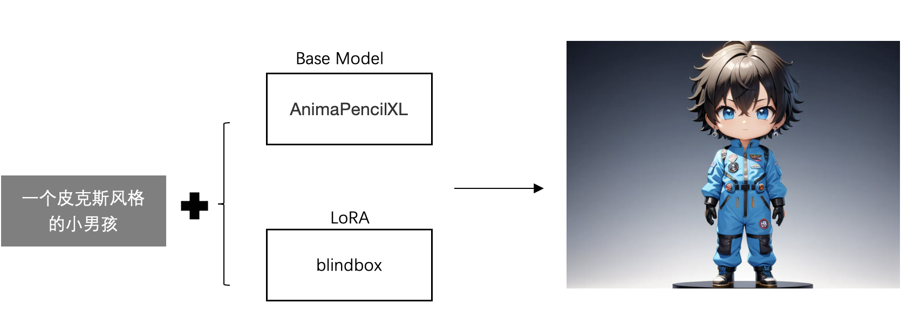
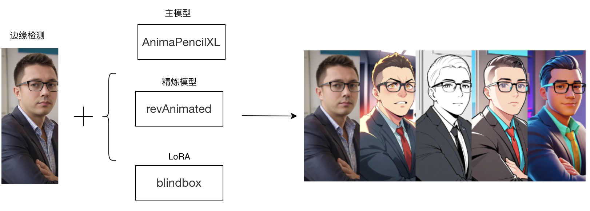
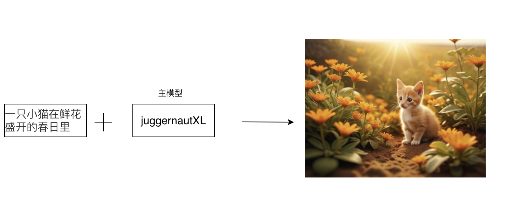
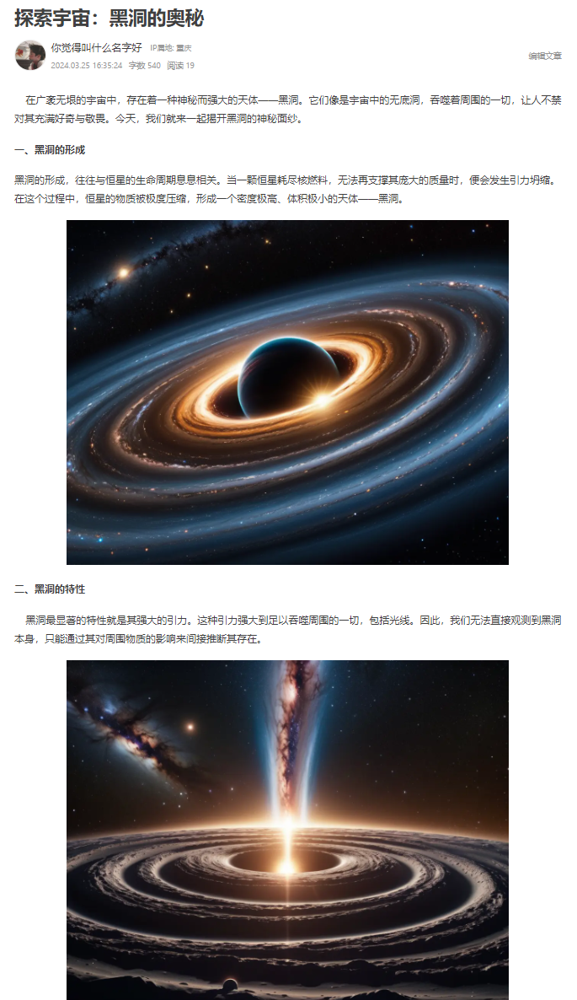
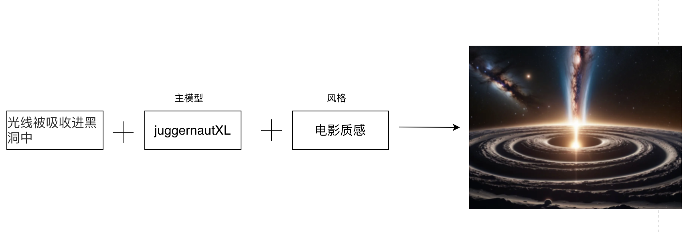
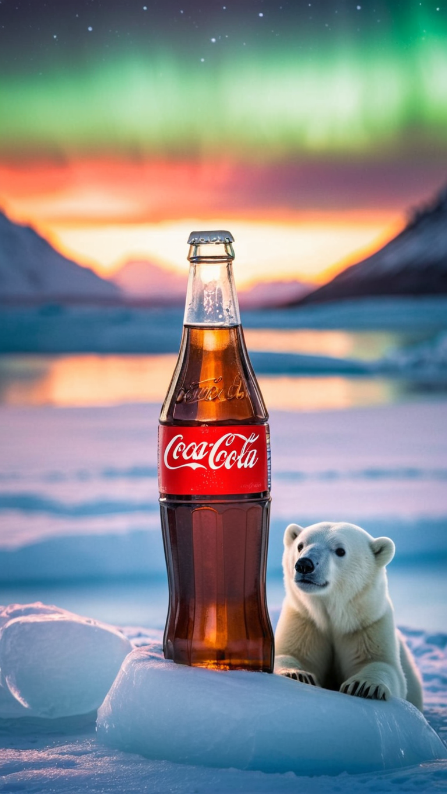
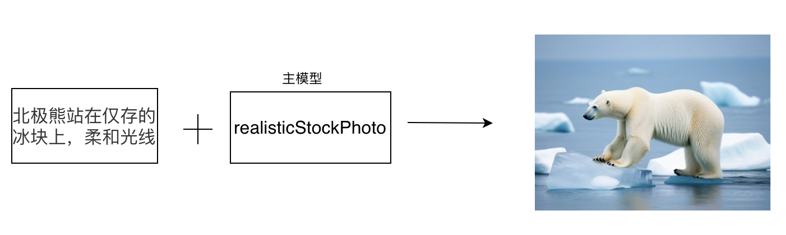

### 1. 媒体创作

#### 1.1 社交平台头像设计

##### 1.1.1 场景说明

在社交平台头像生成中，SimpleSDXL可以帮助用户创建个性化、独特的头像，展示自己的风格和个性。生成各种形式的头像，包括卡通形象、抽象艺术、动物形象等，以满足用户的不同需求和喜好。这种应用可以帮助用户在社交平台上更好地展示自己，增强用户的个人形象和认同感。

##### 1.1.2 效果展示

- 动漫头像生成

  

-  照片转动漫头像 

##### 1.1.3实现原理

-  使用文生图
  
-  使用图片提示
   

##### 1.1.4 视频案例

- 主题: 风格转换-真人转动漫
- 视频链接: [点击访问](https://www.bilibili.com/video/BV1Lx4y1e7fo/)
- 博主: xhox

#### 1.2 社交平台背景设计

##### 1.2.1 场景说明

在社交平台背景设计中，SimpleSDXL可以帮助设计师创造独特、吸引人的背景图像，提升用户体验和社交平台的品牌形象。通过生成丰富多样的背景图像，包括抽象艺术、自然风光、城市景观等，以满足不同用户的喜好和需求。可以帮助社交平台吸引更多用户，提高用户参与度和留存率。

SimpleSDXL可以根据用户的个性化喜好和社交平台的定位，生成与之相匹配的背景图像，使得用户在使用社交平台时感到更加舒适和愉悦。还可以根据不同的时间、节日和主题，动态生成背景图像，增加社交平台的活力和趣味性。

##### 1.2.2 效果展示

- 治愈风格 
  

- 恐怖风格
  

- 儿童节主题背景
  

- 春节主题
  

##### 1.2.3实现原理

 

##### 1.2.4 视频案例

#### 1.3 文章正文配图

##### 1.3.1 场景说明

在文章正文配图中，SimpleSDXL可以帮助作者和编辑选择和生成适合文章内容的插图，提升文章的视觉吸引力和表现力。SimpleSDXL可以根据文章的主题、情感和风格，生成与之相匹配的插图，包括插画、图表、图形等，以增强文章的可读性和表达效果。这种应用可以帮助作者更好地传达文章的意义和信息，同时也能提高读者的阅读体验和理解能力。

##### 1.3.2 效果展示

##### 1.3.3实现原理

##### 1.3.4 视频案例

#### 1.4 宣传推广内容生成

##### 1.4.1 场景说明

在宣传推广内容生成中，SimpleSDXL可以生成各种形式的宣传推广内容，包括海报、广告、插图、动画等，以满足不同推广需求和目标受众。这种应用可以帮助企业和品牌更好地传达产品和服务的特点和价值，吸引潜在客户的关注和兴趣，提高推广活动的转化率和销售额。

##### 1.4.2 效果展示

- 公益宣传

- 广告宣传

  

##### 1.4.3实现原理

##### 1.4.4 视频案例
无