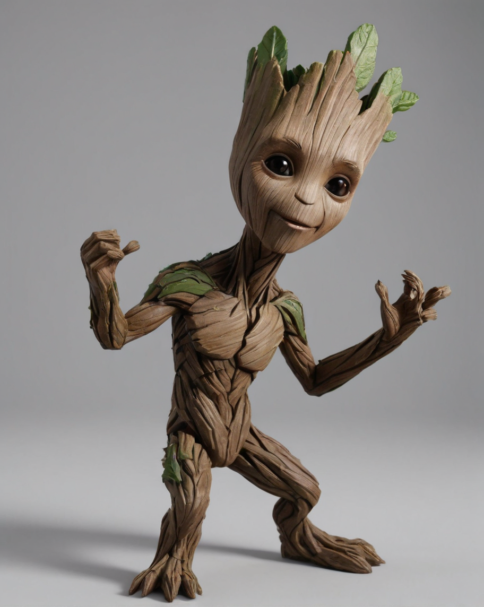

### 2D转3D

#### 10.1 3D建模与渲染

##### 10.1.1 场景说明

SimpleSDXL可以生成可以生成各种不同类型和风格的三维场景和模型，包括建筑、室内、人物、动物等，从而满足不同类型的设计和制作需求，大大缩短了建模周期。同时还能对生成的3D模型进行高质量的渲染，减少了后期处理的工作量。

##### 10.1.2 效果展示

|  |  |
| ------------------------------ | ------------------------------ |

##### 10.1.3实现原理

##### 10.1.4 视频案例

- 主题: 手把手教你用AI把草图做成3D骨骼动画
- 视频链接: [点击访问](https://www.bilibili.com/video/BV18e411Z7Qe)
- 博主: 设计师的AI工具箱

#### 10.2 2D图像生成3D模型

##### 10.2.1 场景说明

SimpleSDXL可以将2D图像转换为逼真的3D模型，展示出模型的细节和立体感。可以实现模型的不同视角和姿态，让模型更加生动有趣。同时还可以生成不同风格和类型的3D模型，包括卡通、写实、超现实等，满足不同类型的设计和制作需求。

##### 10.2.2 效果展示

| 2D照片                                                       | 3D照片                                                       |
| ------------------------------------------------------------ | ------------------------------------------------------------ |
|  |  |

##### 10.2.3实现原理

##### 10.2.4 视频案例

- 主题: 运用AI实现原创2d形象3D效果
- 视频链接: [点击访问](https://www.bilibili.com/video/BV1Va4y1T7BG)
- 博主: 插画师小光sir

#### 10.3 3D场景渲染

##### 10.3.1 场景说明

SimpleSDXL能够自动提取图像特征，生成高质量的3D场景渲染结果。这不仅减少了渲染所需的时间和人力成本，还提高了渲染的质量和逼真度，为用户带来了更加真实、细腻的视觉体验。

##### 10.3.2 效果展示

|  |  |
| ------------------------------ | --------------------------------------------------------- |

##### 10.3.3实现原理

##### 10.3.4 视频案例

- 主题: 运用AI实现原创2d形象3D效果
- 视频链接: [点击访问](https://www.bilibili.com/video/BV1Va4y1T7BG)
- 博主: 插画师小光sir