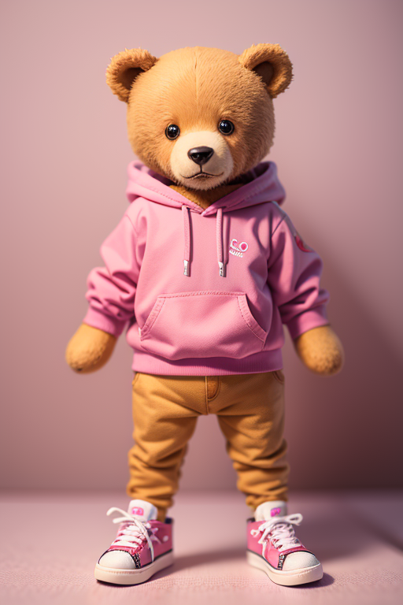
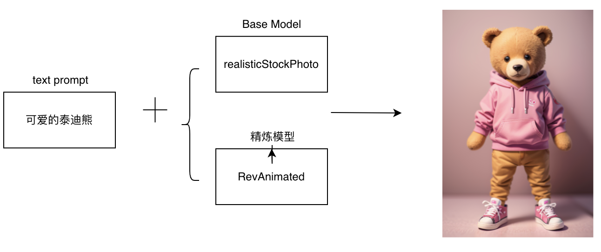
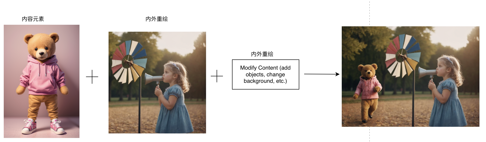

### AR & VR

#### 11.1 AR/VR内容创作

##### 11.1.1 场景说明

SimpleSDXL可以生成高质量的AR/VR内容，实现逼真的光影效果、真实的材质贴图和精细的模型细节，让AR/VR场景和角色更加生动有趣。可以实现高质量的动画效果，包括角色动作、表情、姿态等，提高AR/VR内容的真实感和视觉效果。

##### 11.1.2 效果展示

##### 11.1.3实现原理

​	

##### 11.1.4 视频案例

无

#### 11.2 虚拟物体插入现实场景

##### 11.2.1 场景说明

SimpleSDXL可以将虚拟物体插入现实场景中，可以实现虚拟物体与现实场景的精确对齐和融合，让虚拟物体在现实场景中看起来自然、真实。还可以实现虚拟物体的光影效果、材质贴图和动画效果，提高AR场景的真实感和视觉效果。

##### 11.2.2 效果展示

##### 11.2.3实现原理

	1. 在图像输入的内外重绘中，输入图片并设置方法为Modify Content (add objects, change background, etc.)
	1. 在图像输入的图片提示中，在脸部交换、内容元素中输入AR内容并配置权重
	1. 在内外重绘中勾选混合图片提示

##### 11.2.4 视频案例

无。

#### 11.3 沉浸式体验设计

##### 11.3.1 场景说明

SimpleSDXL可以生成高质量的沉浸式体验，展示出逼真的虚拟环境和角色。通过SimpleSDXL可以实现逼真的光影效果、真实的材质贴图和精细的模型细节，让虚拟场景和角色更加生动有趣，提高沉浸式体验的真实感和沉浸感。

##### 11.3.2 效果展示

无

##### 11.3.3实现原理

​	生成全景图，并配合图片重绘实现3D形象插入

##### 11.3.4 视频案例

无