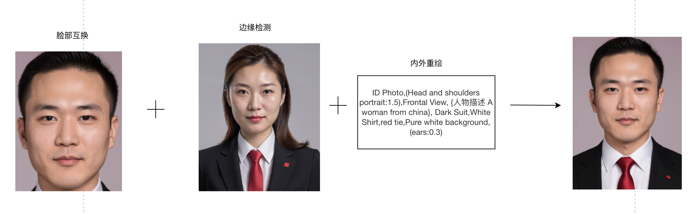

### 12 证件照生成	

#### 12.1 证件ID生成

##### 12.1.1 场景说明

通过SimpleSDXL生成的证件照片，可以达到与传统拍摄照片相媲美的效果。可以根据用户上传的照片或者头像，自动调整照片的亮度、对比度、色彩等参数，使照片更加清晰、饱满、自然。同时还可以根据用户的需求，调整照片的角度、表情、背景等元素，使照片更加符合证件照片的要求和风格。

##### 12.1.2 效果展示

|  |  |  |
| ------------------------------------------------------------ | ------------------------------------------------------------ | ------------------------------------------------------------ |

##### 12.1.3 实现原理

##### 12.1.4 视频案例