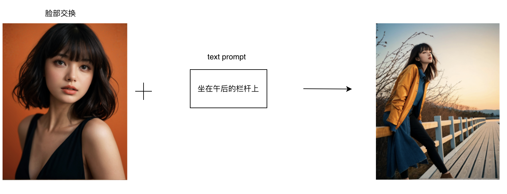
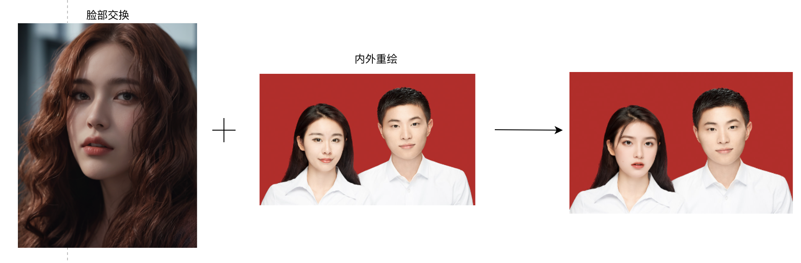

### 影楼写真

#### 13.1 个人写真

##### 13.1.1 场景说明

通过SimpleSDXL生成的个人写真作品，可以呈现出更加个性化、创意化的效果。可以根据用户上传的照片或者头像，自动生成不同的背景、服装、道具等元素，让用户的个人写真作品更加独特和有趣。同时还可以调整照片的色彩、光线、角度等参数，使照片更加生动、自然。

##### 13.1.2 效果展示

|  |  |
| ------------------------------------------------------------ | ------------------------------------------------------------ |
|  |  |

##### 13.1.3 实现原理

##### 13.1.4 视频案例

#### 13.2 婚纱照

##### 13.2.1 场景说明

通过SimpleSDXL生成的婚纱照作品，可以呈现出更加浪漫、唯美的效果。可以生成不同的背景、服装、道具等元素，让新人的婚纱照作品更加独特和有趣。SimpleSDXL生成的婚纱照作品可以呈现出更加梦幻、唯美的效果，让新人的婚纱照更加难忘、珍贵。

##### 13.2.2 效果展示

* 案例一
  * 模特照片

| 原结婚照                                                     | 合成后                                                       |
| ------------------------------------------------------------ | ------------------------------------------------------------ |
|  |  |

* 案例二

  * 模特照片

    

| 原婚纱照                                                     | 合成后                                                       |
| ------------------------------------------------------------ | ------------------------------------------------------------ |
|  |  |

##### 13.2.3 实现原理

##### 13.2.4 视频案例
无