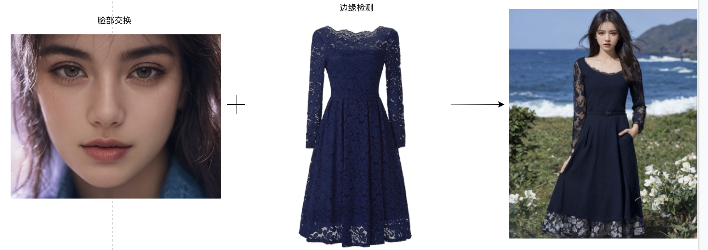
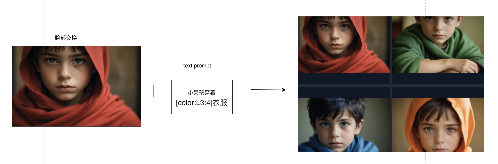

### 虚拟试妆与试衣

#### 14.1 虚拟试衣

##### 14.1.1 场景说明

在虚拟试衣领域，SimpleSDXL可以为用户提供更加真实、逼真的试衣体验。传统的试衣需要用户亲自到实体店或者试衣间进行试穿，而且需要花费大量的时间和精力。而SimpleSDXL可以通过用户上传的照片或者头像，快速生成符合用户需求的虚拟试衣效果，同时还可以根据用户的喜好和风格进行调整和优化。这样不仅可以节省用户的时间和精力，还可以让用户更好地了解和选择适合自己的服装。

##### 14.1.2 效果展示

* 原图片

| 服装                                                         | 试装                                                         |
| ------------------------------------------------------------ | ------------------------------------------------------------ |
|  |  |
|  |  |

##### 14.1.3 实现原理

##### 14.1.4 视频案例

#### 14.2 虚拟试妆

**巧用通配符**
小男孩试装 四色服装

[https://www.bilibili.com/video/BV1Qu4m1g7N9/](https://www.bilibili.com/video/BV1Qu4m1g7N9/)

##### 14.2.1 场景说明

通过SimpleSDXL生成的虚拟试妆效果，可以呈现出更加真实、逼真的效果。可以根据用户上传的照片或者头像，自动生成不同的妆容、发型、配饰等元素，让用户的虚拟试妆效果更加独特和有趣。同时还可以根据用户的需求，调整妆容的色彩、浓淡、光影等参数，使妆容更加生动、自然。SimpleSDXL的虚拟试妆效果可以呈现出更加真实、逼真的效果，让用户更好地了解和选择适合自己的妆容。

##### 14.2.2 效果展示

|  |  |
| ------------------------------------------------------------ | ------------------------------------------------------------ |
|  |  |

##### 14.2.3 实现原理

##### 14.2.4 视频案例