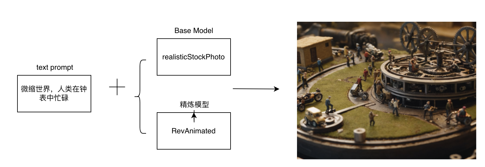

### 微缩世界

#### 15.1 微缩世界

##### 15.1.1 场景说明

在微缩世界的创作中，SimpleSDXL能够精准地捕捉并还原各种景物的细节和特色。无论是古老的城堡、繁华的都市，还是静谧的乡村、神秘的森林，AI绘画都能够以细腻入微的笔触，将这些景物以微缩的形式呈现出来。它不仅可以模拟出景物的形态和结构，还能够还原出光影、色彩和纹理等细节，使得微缩模型更加逼真、生动。

##### 15.1.2 效果展示

|  |  |
| ---------------------------------- | ----------------------------------- |

##### 15.1.3 实现原理

##### 15.1.4 视频案例
无