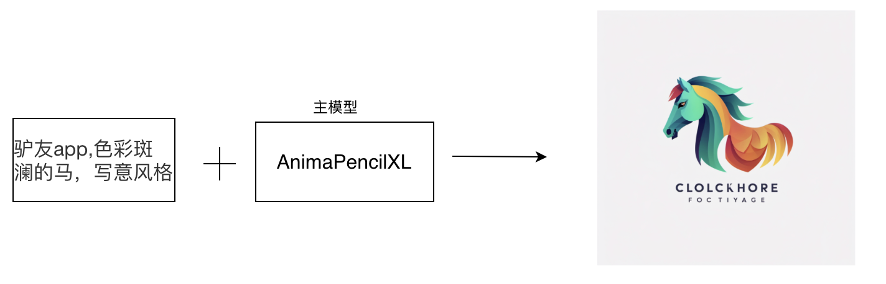
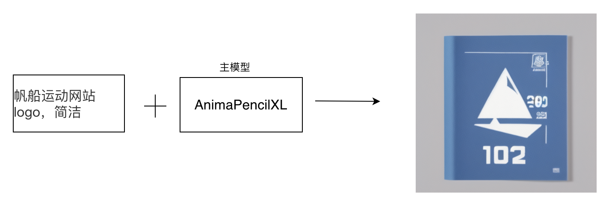
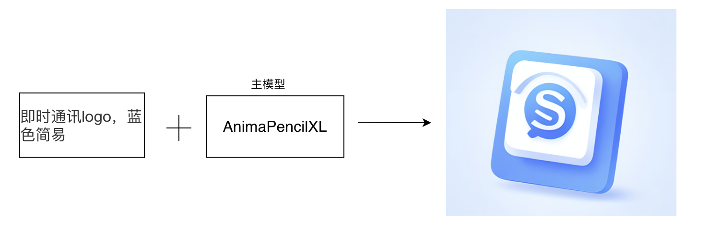
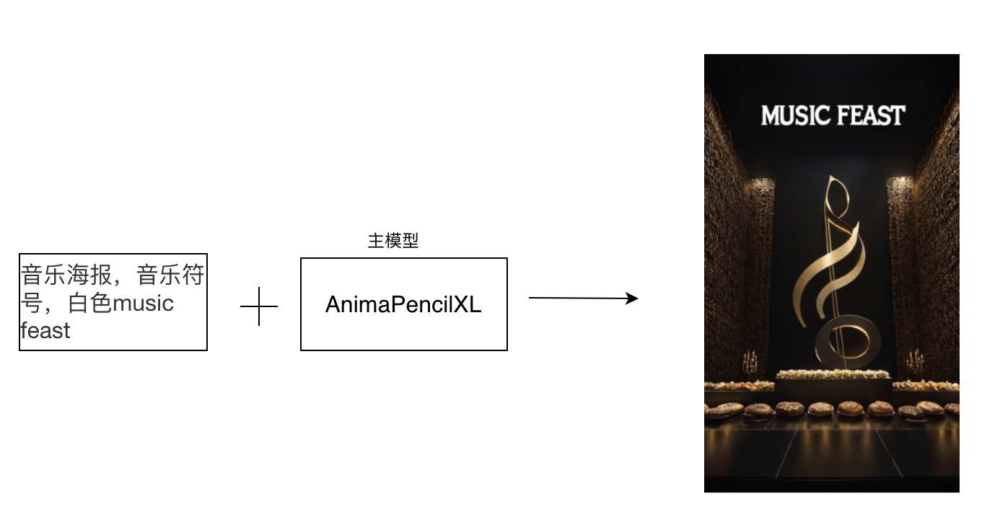

### 广告与营销

#### 2.1 应用程序LOGO设计

##### 2.1.1 场景说明

在应用程序LOGO设计中，SimpleSDXL可以帮助设计师和企业创造独特、专业的标志，提升应用程序的品牌形象和辨识度。可以生成各种形式的LOGO设计，包括图形、字体、图标等，以满足不同应用程序的定位和风格。

##### 2.1.2 效果展示

-  驴友app
   

##### 2.1.3实现原理

##### 2.1.4 视频案例

#### 2.2 网站图标与徽章设计

##### 2.2.1 场景说明

在网站图标与徽章设计中，通过使用SimpleSDXL，可以生成各种形式的图标和徽章设计，包括简约的线图、丰富的色彩、精细的细节等，以满足不同网站的定位和风格。

##### 2.2.2 效果展示

- 帆船运动网站

##### 2.2.3实现原理

##### 2.2.4 视频案例
无

#### 2.3 社交媒体图标设计

##### 2.3.1 场景说明

在社交媒体图标设计中，SimpleSDXL可以帮助设计师和企业创造独特、简洁的图标，提升社交媒体平台的品牌形象和用户体验。生成各种形式的社交媒体图标设计，包括简约的线图、鲜明的色彩、易于识别的图形等，以满足不同社交媒体平台的定位和风格。

##### 2.3.2 效果展示

- 即时通讯app

##### 2.3.3实现原理

##### 2.3.4 视频案例

#### 2.4 海报设计

##### 2.4.1 场景说明

在社交媒体海报设计中，SimpleSDXL可以帮助设计师创作出引人注目、富有创意的海报，吸引用户的注意力并传达信息。设计师可以使用SimpleSDXL生成各种风格的海报，包括现代简约、复古怀旧、艺术抽象等，以适应不同的社交媒体平台和目标受众。

同时可以不断调整，生成独特的图案、色彩和字体，快速生成多个设计方案，以便选择最佳的设计方案，使海报更具视觉冲击力和吸引力，并节省设计时间和成本。

##### 2.4.2 效果展示

##### 2.4.3实现原理

##### 2.4.4 视频案例
无
