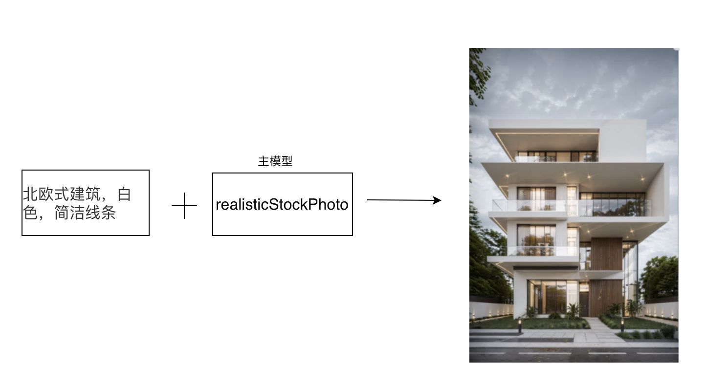
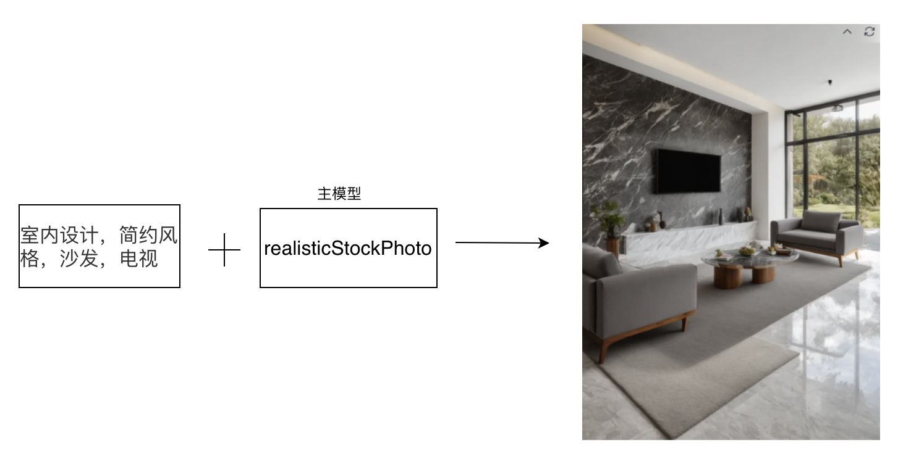
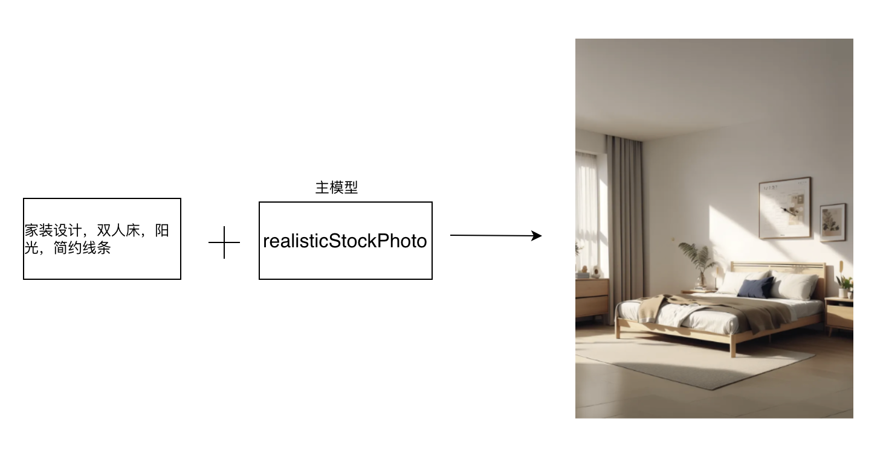

### 家装与建筑

#### 3.1 建筑设计

##### 3.1.1 场景说明

在建筑设计中，SimpleSDXL可以帮助建筑师和设计师创作出独特、创新的建筑外观和室内设计。使用SimpleSDXL，设计师可以生成各种风格的建筑外观，包括现代简约、古典复古、有机自然等，以满足不同项目的需求和客户的喜好。

##### 3.1.2 效果展示

##### 3.1.3实现原理

##### 3.1.4 视频案例
无

#### 3.2 室内设计

##### 3.2.1 场景说明

在室内设计领域，SimpleSDXL可以帮助设计师和客户更好地展示和理解设计概念。通过使用SimpleSDXL技术，可以创建逼真的室内场景，包括家具、墙壁、地板、灯光等元素，以及不同的风格和色彩搭配。这种应用可以帮助设计师更快速地生成多种设计方案，并让客户更直观地感受到最终效果，从而更好地参与和决策设计过程。

##### 3.2.2 效果展示

##### 3.2.3实现原理

##### 3.2.4 视频案例
无

#### 3.3 家装设计

##### 3.3.1 场景说明

在家装设计场景中，SimpleSDXL可以为设计师和业主提供更加直观、生动的家居空间展示。设计师可以将自己的创意和想法以更加真实、立体的方式呈现出来，让业主更好地理解和感受家居的布局、色彩搭配、家具摆放等细节。同时还可以根据业主的需求和偏好进行个性化定制，为业主提供更加满意的家装设计方案。

##### 3.3.2 效果展示

##### 3.3.3实现原理

##### 3.3.4 视频案例
无