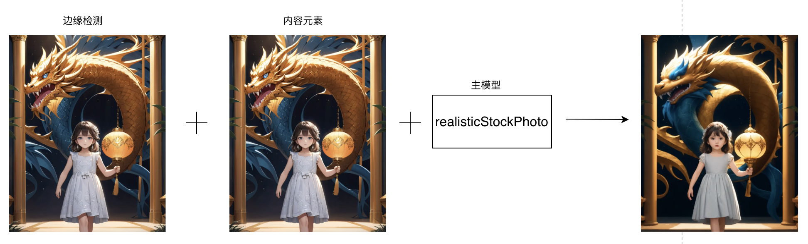

### 图像风格转换

#### 4.1 黑白照片上色

##### 4.1.1 场景说明

在黑白照片上色场景中，通过SimpleSDXL可以将黑白照片上色，让照片中的人物、场景、物体等更加真实、立体，增强照片的观赏性和艺术性。通过还原照片中的色彩，我们可以更深入地理解当时的社会背景、人物情感和故事情节，引发观众的情感共鸣。

##### 4.1.2 效果展示

##### 4.1.3实现原理

##### 4.1.4 视频案例

- 主题: 线稿上色
- 视频链接: [点击访问](https://www.bilibili.com/video/BV1dC4y1Y77A)
- 博主: 吴杨峰

#### 4.2 绘画风格转换

* 图生图技巧
  

##### 4.2.1 场景说明

在绘画风格转换场景中，SimpleSDXL可以为设计师提供更加多样化、创新的绘画风格展示。通过SimpleSDXL可以将自己的作品转换成不同的绘画风格，如印象派、立体派、抽象派等，以丰富作品的表现形式和艺术内涵。还可以根据需求和偏好进行个性化风格转换，为艺术创作提供更加高效、精准的方案。

##### 4.2.2 效果展示

| 动漫                                                         | 写实                                              |
| ------------------------------------------------------------ | ------------------------------------------------- |
|  |  |

##### 4.2.3实现原理

##### 4.2.4 视频案例

- 主题: Fooocus图生图技巧
- 视频链接: [点击访问](https://www.bilibili.com/video/BV187421N7aR/)
- 博主: 是说新语111

#### 4.3 滤镜效果应用

##### 4.3.1 场景说明

在滤镜效果应用场景中，通过SimpleSDXL，设计师可以将自己的图像应用不同的滤镜效果，如黑白、复古、艺术等，以增强图像的艺术感和表现力。同时可以根据设计师的需求和偏好进行个性化滤镜效果应用，为图像处理提供更加高效、精准的方案。

##### 4.3.2 效果展示

| 原照片                 | 白柔滤镜               |
| ---------------------- | ---------------------- |
|  |  |

##### 4.3.3实现原理

##### 4.3.4 视频案例
无

#### 4.4 风格迁移

##### 4.4.1 场景说明

通过SimpleSDXL，可以将一张图片的风格迁移到另一张图片上，实现风格的融合与转换。将自己的图像应用不同的艺术风格，如印象派、立体派、抽象派等。例如，可以将一幅古典油画的风格应用到现代摄影作品上，或将一种流行的艺术风格应用于产品设计图。

##### 4.4.2 效果展示

| 原照片               | 风格迁移               |
| -------------------- | ---------------------- |
|  |  |

##### 4.4.3实现原理

##### 4.4.4 视频案例

- 主题: Fooocus图生图技巧
- 视频链接: [点击访问]([https://www.bilibili.com/video/BV16B4y1Z7LP/](https://www.bilibili.com/video/BV16B4y1Z7LP/))
- 博主: AK智汇