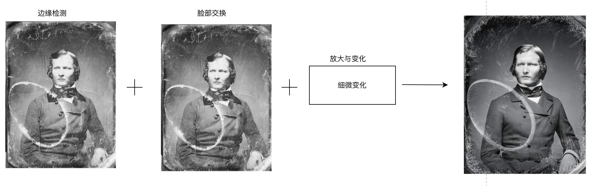
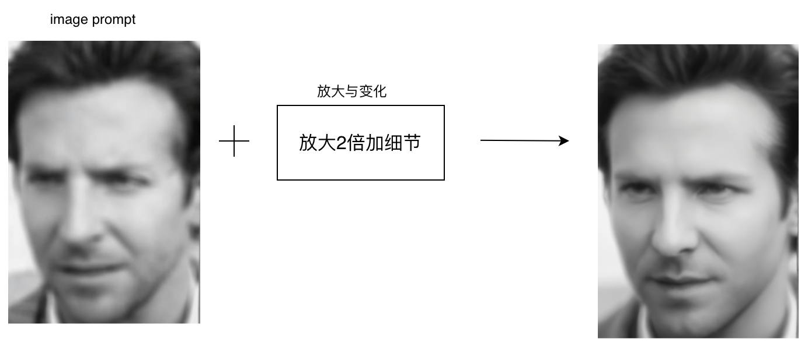
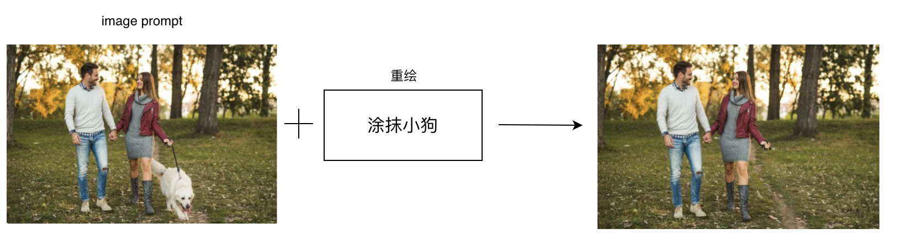

### 图像修复与增强

#### 5.1 老照片修复

##### 5.1.1 场景说明

照片往往承载着珍贵的历史记忆和文化价值，但由于时间的流逝和保存条件的影响，它们可能会出现褪色、破损等问题，导致细节和色彩丢失。通过SimpleSDXL可以有效地修复这些老照片，恢复其原有的细节，让历史记忆得以重现，让文化价值得以传承。

##### 5.1.2 效果展示

##### 5.1.3实现原理

##### 5.1.4 视频案例

- 主题: 老照片修复实战教程
- 视频链接: [点击访问]([[https://www.bilibili.com/video/BV1ue411m7nG/](https://www.bilibili.com/video/BV1ue411m7nG/))
- 博主: 村边小河666

#### 5.2 模糊图像清晰化

##### 5.2.1 场景说明

使用SimpleSDXL，可以实现对模糊图像的清晰化处理，恢复图像的细节和清晰度。经过处理后的图像，可以更加清晰、细腻，更加逼真地呈现图像的真实场景。

##### 5.2.2 效果展示

##### 5.2.3实现原理

​加入SUPIR等清晰化的模型。

##### 5.2.4 视频案例

- 主题: 老照片修复+图片高清化+一键抠图超详细讲解
- 视频链接: [点击访问](https://www.bilibili.com/video/BV1As4y117N7)
- 博主: AI小王子Jay

#### 5.3 图像超分辨率增强

##### 5.3.1 场景说明

超分辨率增强技术能够显著提升图像的分辨率和清晰度，使得原本模糊或低分辨率的图像变得更为清晰和细腻。这对于许多领域，如医学影像、安防监控、卫星遥感等，都具有重要的应用价值。我们可以对这些图像进行高效、准确的超分辨率处理，从而提取更多的细节信息。

##### 5.3.2 效果展示

##### 5.3.3实现原理

##### 5.3.4 视频案例

- 主题: 老照片修复+图片高清化+一键抠图超详细讲解
- 视频链接: [点击访问](https://www.bilibili.com/video/BV1As4y117N7)
- 博主: AI小王子Jay

#### 5.4 去除图像瑕疵或多余元素

##### 5.4.1 场景说明

在图像处理和计算机视觉领域，图像瑕疵和多余元素是常见的问题，它们可能是由于图像采集设备的限制、图像传输过程中的失真或者图像处理算法的不足等原因引起的。这些瑕疵和多余元素会影响图像的质量和可用性，甚至会干扰图像的分析和识别。因此，去除图像瑕疵和多余元素是一个重要的研究方向和应用场景。使用SimpleSDXL，可以实现对图像瑕疵和多余元素的去除处理，提高图像的质量和可用性。

##### 5.4.2 效果展示

| 原照片                                                | 去除元素                                     |
| ----------------------------------------------------- | -------------------------------------------- |
|  |  |

##### 5.4.3实现原理

##### 5.4.4 视频案例

- 主题: 如何使用SD消除图片中的文字或物体
- 视频链接: [点击访问](https://www.bilibili.com/video/BV18m4y1x7VD)
- 博主: 万物熔炉