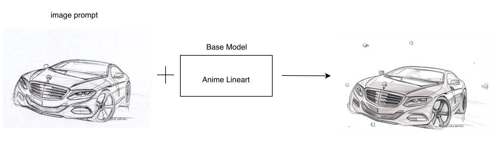
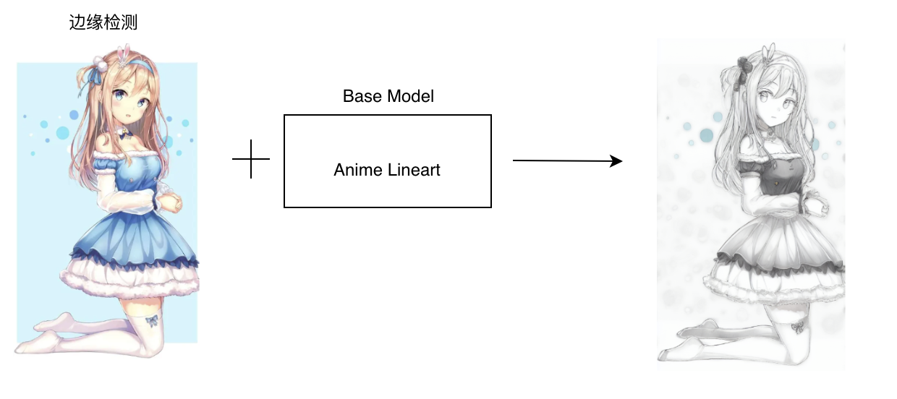
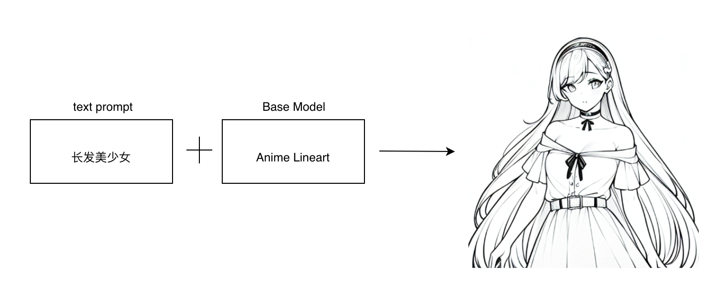
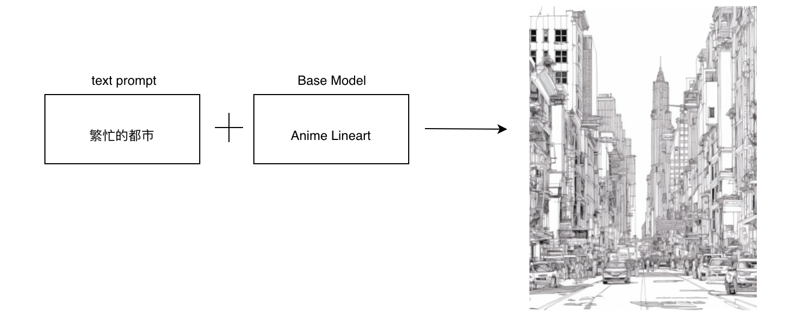
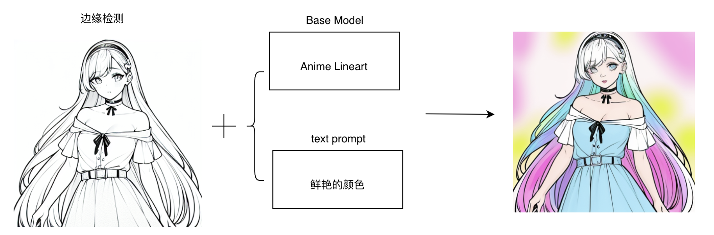

### 线稿提取与着色

#### 6.1 手绘线稿提取

##### 6.1.1 场景说明

传统的手绘过程耗时耗力，而且难以进行修改和调整。通过使用SimpleSDXL模型进行手绘线稿提取，快速将手绘草图转化为数字线稿，进而在数字环境中进行后续的编辑和创作。

##### 6.1.2 效果展示

| 手绘稿                                                       | 电子稿                                                       |
| ------------------------------------------------------------ | ------------------------------------------------------------ |
|  |  |

##### 6.1.3实现原理

##### 6.1.4 视频案例

- 主题: 线稿提取
- 视频链接: [点击访问](https://www.bilibili.com/video/BV1T94y16753)
- 博主: 虫虫飞乐园

#### 6.2 照片转线稿

##### 6.1.1 场景说明

照片转线稿是一种常见的图像处理技术，它可以将照片转换成线条艺术风格的图像，使得图像更加简洁、清晰，更加适合用于插画、漫画、设计等领域。传统的照片转线稿方法需要手工绘制，耗时耗力，SimpleSDXL可以实现自动化的照片转线稿处理，大大提高了效率和质量。

使用SimpleSDXL，可以实现对照片的自动转换，将照片转换成线条艺术风格的图像。经过处理后的图像，可以更加简洁、清晰，更加逼真地呈现图像的线条和结构信息。同时还可以根据不同的线条风格和参数设置，实现不同的线条艺术效果，满足不同的应用需求。

##### 6.1.2 效果展示

| 照片                                                         | 线稿                                                         |
| ------------------------------------------------------------ | ------------------------------------------------------------ |
|  |  |

##### 6.1.3实现原理

##### 6.1.4 视频案例

- 主题: 照片转线稿
- 视频链接: [点击访问](https://www.bilibili.com/video/BV1dg4y1K7L9)
- 博主: 斯九阳

#### 6.3 插画线稿生成

##### 6.1.1 场景说明

传统的插画线稿生成方法需要手工绘制，耗时耗力，使用SimpleSDXL可以实现自动化的插画线稿生成，大大提高了效率和质量，使得图像更加生动、有趣。

##### 6.1.2 效果展示

##### 6.1.3实现原理

​	

##### 6.1.4 视频案例

- 主题: 如何用Controlnet来创建线稿作品
- 视频链接: [点击访问](https://www.bilibili.com/video/BV18T411a77j)
- 博主: 人工治障

#### 6.4 建筑设计线稿生成

##### 6.1.1 场景说明

采用SimpleSDXL可以更加简洁、清晰，更加逼真地呈现建筑设计的线条和结构信息。根据不同的线条风格和参数设置，实现不同的线条艺术效果，满足不同的应用需求。

##### 6.1.2 效果展示

##### 6.1.3实现原理

##### 6.1.4 视频案例

- 主题: 如何用Controlnet来创建线稿作品
- 视频链接: [点击访问](https://www.bilibili.com/video/BV18T411a77j)
- 博主: 人工治障

#### 6.5 线稿着色

##### 6.1.1 场景说明

通过调整模型参数和着色风格，艺术家可以轻松地实现不同风格的着色效果，从而探索出更多新颖、独特的创作思路。这有助于打破传统着色的局限性，推动艺术创作的多样性和创新性。

##### 6.1.2 效果展示

* 案例一

  | 线稿                                                         | 着色                                                         |
  | ------------------------------------------------------------ | ------------------------------------------------------------ |
  |  |  |

* 案例二

  | 线稿                                                         | 着色                                                         |
  | ------------------------------------------------------------ | ------------------------------------------------------------ |
  |  |  |

##### 6.1.3实现原理

##### 6.1.4 视频案例

- 主题: fooocus线稿上色
- 视频链接: [点击访问](https://www.bilibili.com/video/BV1dC411s7Z1)
- 博主: 是说新语111