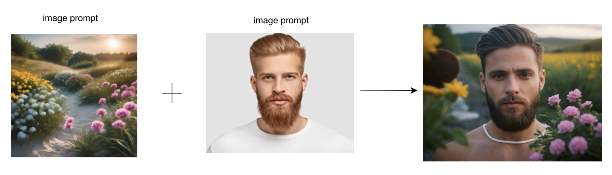
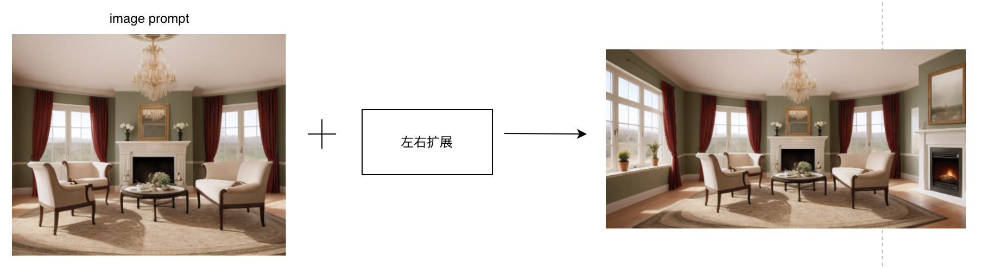
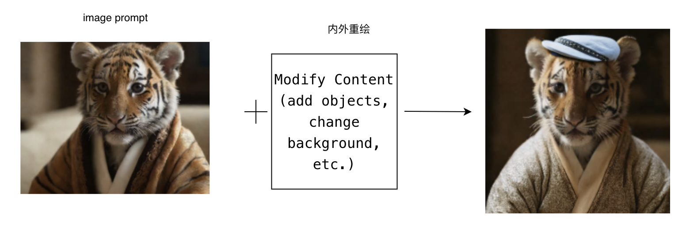
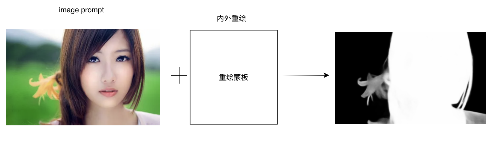

### 图像合成与拼接

#### 7.1 多重图像融合

##### 7.1.1 场景说明

将原本分散的信息和元素结合在一起，形成具有深意的整体画面。这种融合不仅丰富了作品的视觉效果，还有助于表达更为复杂、深刻的思想和情感。

##### 7.1.2 效果展示

- 融合前

  |  |  |
  | ------------------------------------------------------------ | ------------------------------------------------------------ |

- 融合后
  

##### 7.1.3实现原理

​	

##### 7.1.4 视频案例

- 主题: Fooocus进阶技巧 · 风格转绘，扩图，换脸
- 视频链接: [点击访问](https://www.bilibili.com/video/BV1Br421x7uL/)
- 博主: 魏岚Levi

#### 7.2 图像拼接(全景图生成)

##### 7.2.1 场景说明

通过将多张局部图像拼接在一起，我们可以获得一个连续、无缝的全景图像，从而能够更全面地了解场景的全貌。这种全景图在旅游、地产、虚拟现实等领域具有广泛应用，能够为用户提供沉浸式的视觉体验，帮助他们更好地了解环境和空间布局

##### 7.2.2 效果展示

##### 7.2.3实现原理

##### 7.2.4 视频案例

- 主题:  360度全景图生成方法
- 视频链接: [点击访问](https://www.bilibili.com/video/BV1Fz4y137Vk)
- 博主: 坏心眼猫特效

#### 7.3 元素替换与合成

##### 7.3.1 场景说明

轻松地将图像中的某个元素替换为另一个元素，或者将多个元素合成在一起，创造出全新的视觉效果。能够更自由地表达创意，实现更加个性化和独特的作品。

##### 7.3.2 效果展示

* 案例一

  | 原照片                                                       | 合成                                                         |
  | ------------------------------------------------------------ | ------------------------------------------------------------ |
  |  |  |

* 案例二

  | 原照片                                                       | 合成                                                         |
  | ------------------------------------------------------------ | ------------------------------------------------------------ |
  |  |  |

##### 7.3.3实现原理

##### 7.3.4 视频案例

- 主题:  fooocus亿点点技巧，换装技巧，换衣服，加帽子
- 视频链接: [点击访问](https://www.bilibili.com/video/BV16H4y177gG/)
- 博主: 是说新语111

#### 7.4 图像蒙版

##### 7.4.1 场景说明

使用SimpleSDXL，可以实现对图像的自动蒙版制作，根据图像的内容和特征，自动生成适当的蒙版效果。可以更加精确地控制图像的显示和隐藏，提高图像的质量和效果。

##### 7.4.2 效果展示

| 原照片                                                       | 蒙版                                                         |
| ------------------------------------------------------------ | ------------------------------------------------------------ |
|  |  |

##### 7.4.3实现原理

##### 7.4.4 视频案例

- 主题: 局部重绘与蒙版重绘
- 视频链接: [点击访问](https://www.bilibili.com/video/BV1mj411j7fv)
- 博主: 原创ai绘画设计师