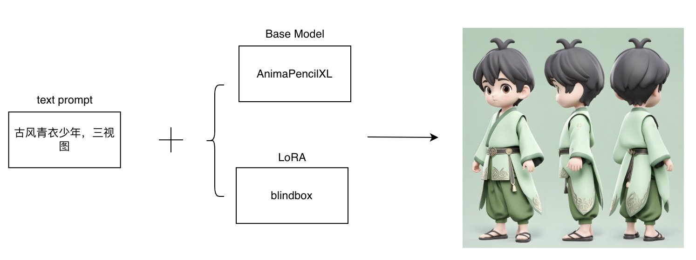
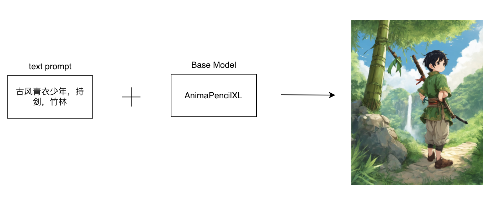
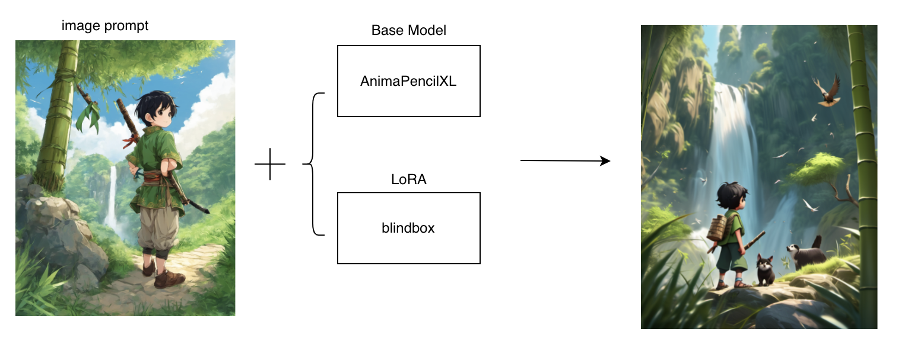

### 动画与游戏

#### 8.1 动画设计

##### 8.1.1 场景说明

使用SimpleSDXL，可以实现对静态图像或者场景的自动动画设计，根据图像或者场景的内容和特征，自动生成适当的动画效果。

##### 8.1.2 效果展示

##### 8.1.3实现原理

1. 通过文生图生成满意的图像，固定种子
2. 在图像提示中，使用图像提示的脸部交换，配合文本提示实现角色一致性和动作、服装、背景等的生成
3. 使用图片融合，后续加入Animediff等实现动画生成

##### 8.1.4 视频案例

- 主题: AnimateDiff动画插件全方位教学
- 视频链接: [点击访问](https://www.bilibili.com/video/BV1zS421A7PG)
- 博主: Nenly

#### 8.2 形象设计

##### 8.2.1 场景说明

在形象设计领域，SimpleSDXL可以帮助设计师和动画制作团队更快速、高效地创造出独特、生动的角色形象。可以生成各种不同风格和类型的动画角色，包括人物、动物、怪物等，从而满足不同类型动画作品的需求。

##### 8.2.2 效果展示

##### 8.2.3实现原理

##### 8.2.4 视频案例

- 主题: 运用AI实现原创IP形象2D转3D效果
- 视频链接: [点击访问](https://www.bilibili.com/video/BV1hs4y117qA)
- 博主: 插画师小光sir

#### 8.3 原画设计

##### 8.3.1 场景说明

在原画设计领域，SimpleSDXL可以帮助插画师和动画师更快速、高效地创作出独特、生动的原画作品。可以生成各种不同风格和类型的原画作品，包括插画、概念艺术、角色设计等，从而满足不同类型的创作需求。

##### 8.3.2 效果展示

##### 8.3.3实现原理

##### 8.3.4 视频案例

- 主题: 用SD四步生成游戏原画设计是什么感觉
- 视频链接: [点击访问](https://www.bilibili.com/video/BV1BN41137Fc)
- 博主: AI绘画小小皮

#### 8.4 模型设计

##### 8.4.1 场景说明

在动画模型设计领域，SimpleSDXL可以更快速、高效地创建出逼真的三维动画模型。可以生成各种不同类型和风格的动画模型，包括人物、动物、怪物、道具等，从而满足不同类型的动画制作需求。

##### 8.4.2 效果展示

##### 8.5.3实现原理

##### 8.5.4 视频案例

- 主题: 用SD四步生成游戏原画设计是什么感觉
- 视频链接: [点击访问](https://www.bilibili.com/video/BV1BN41137Fc)
- 博主: AI绘画小小皮