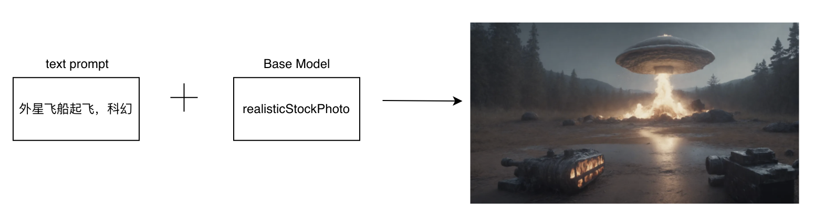
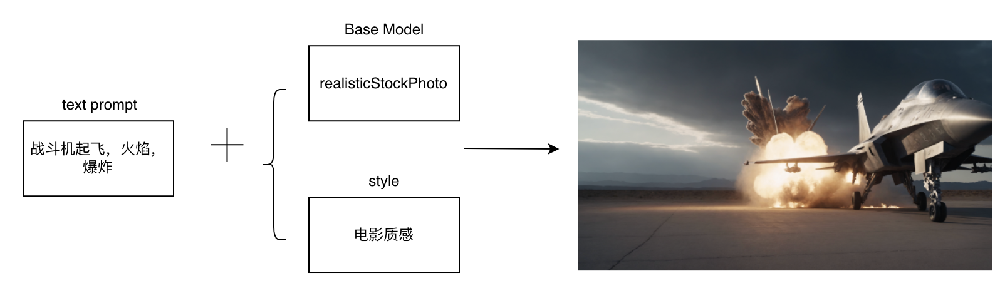

### 影视与娱乐

#### 9.1 电影场景设计

##### 9.1.1 场景说明

在电影场景设计场景中，SimpleSDXL可以为电影制片人和导演提供更加直观、生动的场景展示。制片人和导演可以将自己的创意和想法以更加真实、立体的方式呈现出来，让观众更好地理解和感受电影的场景、氛围、情感等细节。同时还可以根据电影的剧情和风格进行个性化定制，为电影制作提供更加高效、精准的场景设计方案。

##### 9.1.2 效果展示

##### 9.1.3实现原理

##### 9.1.4 视频案例

- 主题: 简单懒人可控StabelDiffusion AI辅助绘画场景细化
- 视频链接: [点击访问](https://www.bilibili.com/video/BV1rk4y1W7YE/)
- 博主: tianzi_天恣

#### 9.2 电影特效设计

##### 9.2.1 场景说明

可以生成具有各种风格、各种效果的特效图像，为电影特效设计提供了丰富的素材和灵感。这有助于设计师突破传统特效设计的限制，创造出更加独特、新颖的特效效果，提升电影的视觉冲击力和观赏性。

##### 9.2.2 效果展示

##### 9.2.3实现原理

##### 9.2.4 视频案例

- 主题: 简单懒人可控StabelDiffusion AI辅助绘画场景细化
- 视频链接: [点击访问](https://www.bilibili.com/video/BV1rk4y1W7YE/)
- 博主: tianzi_天恣