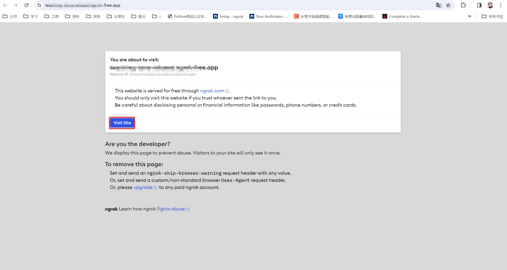

### 1. 前提概要

SimpleSDXL已经实现了局域网访问的功能，当其他设备与部署机在同一局域网中，可以实现远程访问。

* 外网访问，需要实现内网穿透。

### 2. 使用Fooocus自带的gradio

1. 打开SimpleSDXL的run.bat,在后面添加—share

 

2. 保存并运行run.bat,此时在日志中提示需要三个步骤。

​	

3. 下载frpc文件

https://cdn-media.huggingface.co/frpc-gradio-0.2/frpc_windows_amd64.exe

4. 修改下载的文件名称为frpc_windows_amd64_v0.2

5. 复制文件到python_embeded\lib\site-packages\gradio目录中

 

 6. 重新启动run.bat,此时可以看到除了局域网ip之外，还有个临时的外网ip。

 

 

7. 访问测试

 

### 3.使用ngork

1. 首先访问[ngork官网](https://dashboard.ngrok.com/login)，可以选择github登录或者免费注册。

 

2. 登录成功之后，选择下载64位客户端。

 

3. 解压zip包

 

4. 接着对ngork进行配置，复制官网给的命令。

 

5. 打开cmd命令行，切换到ngork目录中，输入命令，此时配置完成。

 

6. 开启内网穿透，一种是临时域名，每次启动都会更换；一种是静态域名，启动之后不变。这里我使用静态域名。

 

7. 复制官网给的静态域名路径，将后面的80改为SimpleSDXL的IP和端口，点击回车。

 

8. 转发完成，此时就可以通过ngork的静态域名访问程序。

 

9. 测试访问，点击visit site，此时可以看到外网访问成功，在任意地方都可以访问了。

 

 

 